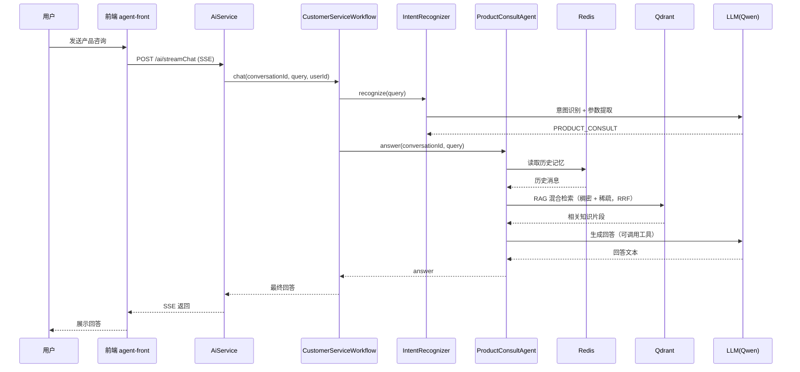

# agent-py — 智能客服 Agent 后端

基于 **FastAPI + LangChain + LangGraph** 的智能客服后端，由 Java 版（Spring Boot + LangChain4j）迁移而来。实现「意图识别 → 多分支分流」的客服工作流，支持 RAG 知识库问答、订单查询、售后投诉处理，SSE 流式输出。

## 技术栈

| 层 | 技术选型 |
|---|---|
| Web 框架 | FastAPI + Uvicorn（SSE 流式接口） |
| 大模型 | LangChain + OpenAI 兼容接口（Qwen / DeepSeek） |
| 工作流编排 | LangGraph（StateGraph 状态图） |
| 检索增强 RAG | HuggingFaceEmbeddings（bge-small-zh-v1.5）+ Qdrant 混合检索（稠密 + BM25 稀疏，RRF 融合） |
| 会话记忆 | Redis（滑动窗口） |
| 持久化 | MongoDB（motor 异步驱动） |
| 配置管理 | pydantic-settings（.env） |

## 业务逻辑

核心是一条「意图识别 → 条件分流 → 生成回答」的客服工作流：

```
用户提问
   │
   ▼
意图识别 + 参数提取（LLM 结构化输出：意图 + order_no / complaint）
   ├─ PRODUCT_CONSULT ─► 产品咨询：RAG + 记忆 + 工具（回答已润色，直接返回）
   ├─ QUERY_ORDER     ─► 订单查询：提取订单号 → 查询订单 → 润色话术
   ├─ COMPLAINT       ─► 售后投诉：提取投诉要点 → 润色受理话术
   └─ UNKNOWN / 其它  ─► 兜底提示重新输入
   │
   ▼
返回回答（SSE 流式）
```

单轮对话完整链路：

1. 用户消息写入 MongoDB
2. 工作流处理（LangGraph：意图识别 + 参数提取 → 条件边分发 → 分支 Agent → 润色兜底）
3. AI 回复写入 MongoDB
4. 产品咨询分支的对话历史写入 Redis（滑动窗口，最多保留 3 条）

### 产品咨询时序图



## 技术架构

分层清晰，依赖集中在组合根（`deps.py`）统一组装：

```
app/
├── api/          接口层：/ai 路由（等价旧 AiController，前端零改动对接）
├── services/     业务服务：会话/消息持久化、Redis 记忆、AI 编排
├── workflow/     工作流：意图识别 + 各分支 Agent + LangGraph 编排
├── rag/          RAG：向量化 + Qdrant 向量库 + 知识库入库
├── config.py     配置项（读 .env / 环境变量）
├── deps.py       依赖容器（组合根，集中创建所有对象）
├── models.py     Pydantic 数据模型
└── application.py FastAPI 应用工厂（生命周期 / CORS / 路由）
```

关键设计点：

- **组合根模式**：所有依赖在 `deps.py` 一处创建，业务代码只取用
- **LangGraph 状态图**：`意图识别 → 条件边` 表达多分支路由，语义清晰可扩展
- **意图识别 + 参数提取**：LLM 结构化输出一次得到意图与参数（order_no / complaint），供分支 Agent 直接使用
- **润色兜底**：统一的润色节点（`ReplyPolisher`）复用，未知意图走兜底提示
- **RAG 混合检索**：稠密向量（语义）+ BM25 稀疏向量（关键词），RRF 融合，兼顾「语义相近」与「关键词命中」
- **LLM 交互日志**：LangChain 回调统一记录每次请求与返回，便于调试
- **工具调用**：产品咨询分支可调用工具（如手机价格查询）

## 目录结构

```
agent-py/
├── main.py                     # 入口：uvicorn 启动（端口 8080）
├── pyproject.toml              # 依赖声明（Python 3.12 + uv）
├── .env.example                # 配置模板
└── app/
    ├── application.py          # FastAPI 应用工厂
    ├── config.py               # Settings 配置
    ├── deps.py                 # 依赖容器（组合根）
    ├── models.py               # Pydantic 模型
    ├── api/ai.py               # /ai 接口
    ├── services/               # 业务服务
    │   ├── ai_service.py           # AI 编排（保存消息 → 工作流 → 保存回复）
    │   ├── conversation_service.py # 会话 CRUD（MongoDB）
    │   ├── chat_message_service.py # 消息 CRUD（MongoDB）
    │   └── redis_memory.py         # Redis 会话记忆
    ├── rag/                    # 检索增强
    │   ├── vector_store.py         # Qdrant 混合检索（稠密 + 稀疏，RRF）+ 入库
    │   └── init.txt                # 知识库文本
    └── workflow/               # 工作流
        ├── customer_service.py     # LangGraph 编排入口
        ├── intent_recognizer.py    # 意图识别 + 参数提取
        ├── reply_polisher.py       # 回复润色 + 兜底提示（可复用）
        ├── intents.py              # 意图枚举
        ├── product_consult.py      # 产品咨询 Agent（RAG + 记忆 + 工具）
        ├── order.py                # 订单 Agent（纯逻辑：提取订单号 + 查询）
        ├── tools.py                # 工具定义
        └── llm_logger.py           # LLM 交互日志回调
```

## 快速开始

### 1. 安装 Python 3.12 与依赖

```bash
uv python install 3.12
uv sync
```

### 2. 配置环境变量

```bash
cp .env.example .env
# 编辑 .env，至少填入 QIANWEN_API_KEY
```

### 3. 准备向量模型与知识库

`EMBEDDING_MODEL_PATH` 可填 HuggingFace 模型 ID（如 `BAAI/bge-small-zh-v1.5`，首次自动下载），或本地模型目录路径。

### 4. 启动依赖服务

本地需可用：MongoDB（27017）、Redis（6379）、Qdrant（HTTP 6333）。

### 5. 启动应用

```bash
uv run python main.py
```

## 对外接口（对齐旧 AiController）

| 方法 | 路径 | 说明 |
|---|---|---|
| POST | `/ai/streamChat` | 流式聊天（SSE），body：`{message, conversationId, userId}` |
| GET | `/ai/conversations` | 会话列表 |
| POST | `/ai/conversation` | 新建会话 |
| PUT | `/ai/conversation` | 重命名会话 |
| DELETE | `/ai/conversation/{conversationId}` | 删除会话及其消息 |
| GET | `/ai/chatMessages?conversationId=` | 会话消息列表 |

---

## 简历可写内容

> 独立设计并实现了一套智能客服 Agent 后端，核心能力与技术亮点：

- **LLM 应用开发**：基于 LangChain + FastAPI 构建客服 Agent，通过 OpenAI 兼容接口接入 Qwen 大模型，实现意图识别、多分支分流、SSE 流式输出。
- **Agent 工作流编排**：使用 LangGraph（StateGraph 状态图 + 条件边）实现「意图识别 → 条件分发」的多 Agent 编排，替代硬编码 if/else，流程可视化、易扩展。
- **RAG 检索增强**：使用 bge-small-zh-v1.5 向量模型 + Qdrant 向量库 + MMR 重排，构建产品知识库问答，提升回答准确性与相关性。
- **多存储整合**：Redis 实现会话记忆（滑动窗口），MongoDB 持久化会话与消息，Qdrant 存储向量，异步驱动（motor / redis.asyncio）提升并发能力。
- **工程化能力**：依赖注入组合根、pydantic-settings 配置管理、LangChain 回调统一记录 LLM 交互日志、结构化输出约束意图分类。
- **技术迁移**：独立将 Java（Spring Boot + LangChain4j）客服系统完整迁移为 Python（FastAPI + LangChain + LangGraph），保持对外接口兼容，前端零改动。
